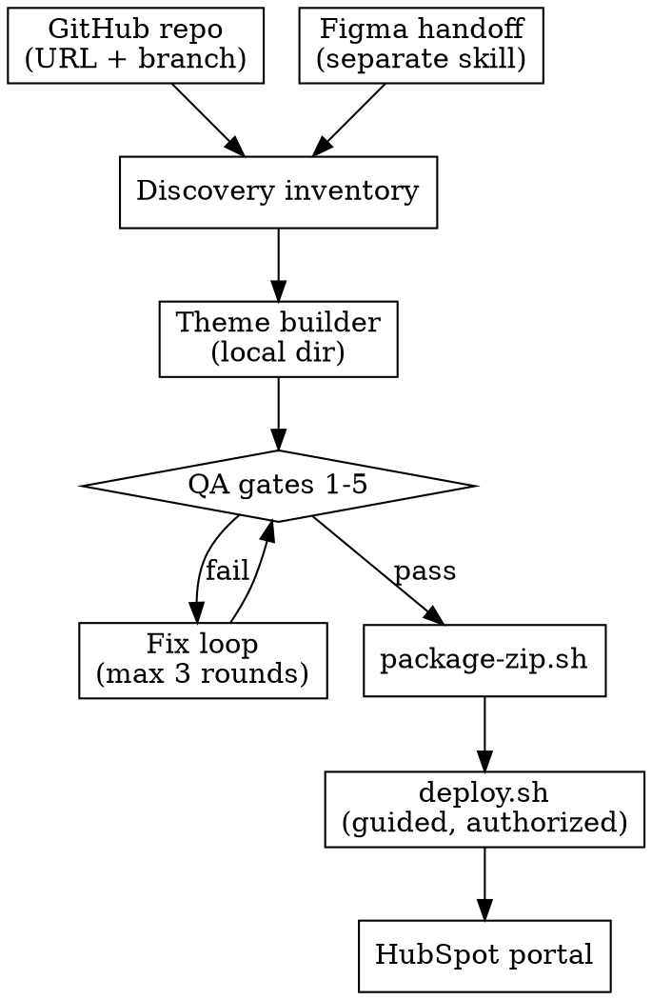

# CMS Pages Full-Site Generation Design

## Purpose

Extend the `man-digital-cms-pages` skill from single-site maintenance (man.digital,
portal `1969772`, one theme) into a full-website creation workflow: a React
(Vite + Tailwind + shadcn) GitHub repo or a Figma handoff goes in, and a
validated, deployable HubSpot theme ZIP comes out — with blog, global
header/footer, responsive layouts, structured images, and marketer-editable
modules. The same skill keeps a lightweight path for small edits on explicit
request.

The system must never push to HubSpot before validation, never guess content
or credentials, and never commit secrets.

## Locked Decisions

All scope questions were answered during brainstorming and are binding:

1. **Scope:** GitHub React → HubSpot full-site flow first, plus small-edits mode
   on explicit prompt. Figma input accepted via the separate Figma skill's
   handoff; that skill is not redesigned here.
2. **GitHub input:** repo URL + branch; the skill clones and discovers. Local
   paths are not accepted as substitutes.
3. **Output:** mandated full-theme shape modeled on the `tj-extek` example —
   no partial outputs from the full-site flow.
4. **QA:** full blocking gates; no ZIP ships until all pass plus a re-verify
   after fixes.
5. **Deploy:** config-driven multi-portal, ZIP-first, push only with explicit
   authorization. Guided CLI prompts are the default UX; direct config editing
   stays available.
6. **Small edits:** explicit trigger phrases only, lightweight validation, no
   forced rebuild or ZIP.
7. **API knowledge:** researched during implementation with Exa.ai + web
   search, bundled into the skill as references. Runtime uses the bundle;
   live lookup only when stuck or on failure.

## Approaches Considered

### 1. Extend the existing skill in place

Keep `man-digital-cms-pages` as one skill with its current `SKILL.md` +
`scripts/` + `references/` shape. Add input adapters, theme builder rules,
blocking QA, ZIP packaging, portal config + deploy runbook, and bundled API
references. Current man.digital maintenance behavior is preserved as the
small-edit path.

This is the selected approach. One skill to update in Git, backward
compatible, matching the `mandigital-claude-skills` repo layout. Growth is
controlled by keeping `SKILL.md` a lean router and putting heavy material in
`references/` files.

### 2. Split into two skills

Keep `man-digital-cms-pages` for maintenance/small edits; create a new
theme-builder skill for full-site generation.

Cleaner separation, but two skills to maintain, shared QA/deploy logic
duplicated or cross-referenced, and a migration for existing users. Rejected.

### 3. Thin orchestrator

Tiny `SKILL.md` with phase checklists only, delegating each phase to agent
judgment with live Exa/web lookup at runtime.

Fastest to write but non-deterministic: QA gates and API usage would vary
per run, contradicting the blocking-QA and bundled-knowledge decisions.
Rejected.

## Components

### Skill structure

The skill keeps its home at
`marketing/web-development/man-digital-cms-pages/`, synced to the
`mandigital-claude-skills` Git repo:

- `SKILL.md` — lean router: mode select (full-site vs small-edit), phase
  checklist, pointers to references. No heavy docs inline.
- `references/inputs-github.md` — repo URL+branch intake, clone/discover
  rules (routes, tokens, components, assets), and the discovery-inventory
  schema (pages, sections, tokens, assets, forms, menus, blog, languages)
  the builder consumes.
- `references/inputs-figma.md` — Figma handoff intake: required section
  specs, tokens, assets, states.
- `references/theme-contract.md` — mandated output shape + module authoring
  rules (marketer-editable fields, no code needed) + the schemas of the two
  skill-custom manifests: `deploy.json` (pages/slugs/menu order, consumed by
  `deploy.sh` — not a HubSpot-native file) and the asset manifest. Also
  pins: blog-post templates use static `` tags (not DnD), every
  module ships `meta.json` host/content types, `.hsignore` is supported.
- `references/qa-checklist.md` — blocking gates + fix-and-reverify loop.
- `references/api-playbook.md` — bundled HubSpot CMS API findings (themes,
  modules, templates, files, pages/blog, deploy, scopes, rate limits).
- `references/deploy-runbook.md` — portal config schema + deploy commands
  (manual/auto, guided by default).
- `scripts/` — keep `ensure-source.sh` / `validate-source.sh`; add
  `validate-theme.sh` (full QA), `package-zip.sh`, `deploy.sh`
  (config-driven, no-op without explicit authorization).

### Input adapters

Two intake paths produce one discovery inventory that the builder consumes.
The builder never reads the raw repo or Figma file directly.

**GitHub path (primary).** Input is repo URL + branch (private repos via
`gh` CLI auth). The skill clones to a work dir (same pattern as
`ensure-source.sh`, new env var `CMS_THEME_INPUT_SOURCE` for the input
source) and writes an inventory. Verified discovery signals from the
reference repo: file-based routes (`src/routes/`, generated route tree)
→ pages; page components (`src/pages/`) → template composition; section
components (`src/components/`) → one module each; `components.json` +
Radix deps → shadcn; `src/styles/tokens.json` (single source of truth,
CSS is generated — read the JSON, not the CSS) → theme tokens;
`src/content/<lang>/` + content data files → copy and blog/news model;
`src/assets/` (bundled, hashed) → `/assets/...` manifest entries and
`public/` → File Manager root paths (e.g. `public/brand/` → `/brand/`);
route prefixes + content langs → languages. Draft, editor-only, and 404
routes are flagged for exclusion instead of becoming templates. Repos
without Vite/Tailwind/shadcn signals stop with a report; the skill does
not guess.

**Figma path.** Triggered when the user says "here is figma" with the Figma
skill's handoff. Required before starting: page/section list, desktop +
mobile specs (node IDs), tokens, exported assets, interactive states.
Incomplete handoff stops with a request for the missing pieces; the skill
never invents copy, tokens, or URLs. The handoff converts to the same
inventory format, so the builder stays input-agnostic.

### Theme builder

Turns the inventory into the mandated full-theme shape, in order:

1. **Tokens first:** global `fields.json` (colors, fonts) + `css/` split
   (`fonts.css`, `variables.css`, `common.css`, `custom.css`) + `theme.json`.
   No hardcoded brand values in modules.
2. **Modules:** one folder per section (`fields.json`, `meta.json`,
   `module.html`, `module.css`, optional `module.js`). Every text, image,
   link, and list a marketer might change is a field. Mandatory: global
   header (nav, language, CTA, mobile drawer) and footer.
3. **Blog:** `blog_listing` + `blog_post` modules wired to the HubSpot blog,
   not static copies.
4. **Templates:** DnD `templates/*.html` composing modules per page, plus
   `deploy.json` (slug, title, menu order, homepage flag).
5. **Assets:** images ship in an `images/` tree with subfolders per section,
   plus an asset manifest mapping each local file to its File Manager
   destination path (e.g. `images/hero/x.jpg` → `/brand/x.jpg`). Module
   defaults reference the File Manager absolute paths (matching the
   `tj-extek` example, which carries no local image folders and points at
   `/assets/...` and `/brand/...`). Theme-relative `get_asset_url` images
   are allowed only for CSS/structural decoration, never for marketer-
   swappable content. Pages interlink (nav, footer, CTAs, language
   switcher).

Output is a local theme directory ready for QA + ZIP. The builder never
contacts HubSpot.

### QA gates and packaging

Gates run in order; any failure fixes and restarts from gate 1:

1. **Completeness:** every inventory page/section exists as modules +
   templates; header/footer/blog present; `deploy.json` covers every page.
2. **Field wiring:** every `fields.json` field is referenced in its
   `module.html`; no orphan fields, no hardcoded marketer-editable content.
3. **Validity:** all JSON parses; `hs cms lint` clean; `hs cms theme
   marketplace-validate` clean; DnD areas and sections well-formed; CSS
   split intact (variables → common → custom, brand values defined once in
   tokens/fields and referenced from modules, not duplicated).
4. **Links + assets:** nav, footer, CTAs, language switcher, and inter-page
   links resolve; every image default has a manifest entry covering its File
   Manager destination; no localhost, placeholder, or unmigrated dev URLs
   remain. Explicit external links from the inventory (fonts, CDN,
   analytics, partner URLs, mailto/tel) are allowlisted, not flagged.
5. **Editor compatibility (staging-verified):** the theme uploads to the
   configured staging portal and `hs cms theme preview` renders it; every
   module renders and is editable in the page editor without code. Fixes
   from this pass re-run gates 1–4. A staging portal entry is mandatory
   config, not optional.
6. **Package:** `package-zip.sh` builds the versioned ZIP from the verified
   directory, named `<theme>-<yyyymmdd>-<input-sha>.zip` from the theme name,
   build date, and input commit. The ZIP is the only deploy artifact:
   `deploy.sh` unzips to a temp dir and uploads the extracted tree (HubSpot
   has no theme-ZIP import). Pushing loose files outside this flow is
   forbidden.

QA evidence (pass/fail per gate) ships with the ZIP.

### Deploy

Push runs only from a QA-passed ZIP, only with explicit authorization, only
through a portal config:

- **Config file** (gitignored, e.g. `portals.yaml`): one entry per portal —
  `portalId`, `hsAccount` (developer CLI account name, Personal Access Key
  based, onboarded via `hs account auth`), `accessToken` (private-app token
  for API/agent-CLI ops, supplied via flag/env, never stored), target theme
  name, one entry flagged as the staging portal, optional per-portal
  overrides (domain, blog IDs, form-ID mapping table). Switching portals
  means selecting a config entry; nothing else changes.
- **Guided CLI is the default UX:** `deploy.sh` prompts (pick portal, confirm
  theme name, supply missing values step by step) and accepts secrets via
  flags/env vars (e.g. `--token "$HS_TOKEN"`) so tokens never need to sit in
  the file. It writes back to `portals.yaml` only when asked. Direct file
  editing stays available.
- **Scopes** (exact strings resolved during API research — UI labels are not
  enough): CMS content incl. pages/blog, File Manager, forms, plus
  account-info read (primary domain, user emails). The playbook records which
  credential (PAK vs private-app token) carries each scope.
- **Tooling:** `hs` (developer CLI: `cms upload`, `cms lint`, `cms theme
  marketplace-validate`, `cms theme preview`) for theme files and validation;
  the `hubspot` agent CLI (`cms pages`, `cms blog-posts`, `marketing forms`,
  `api` passthrough) for content ops; raw API only where neither CLI covers
  the need. Content deploy covers: File Manager image upload per the asset
  manifest, theme upload, page creation per `deploy.json`, menu creation per
  menu order, blog provisioning + template assignment, form-ID mapping.
- **Fallbacks:** manual upload of the same ZIP stays supported. An optional
  deploy smoke test (fetch key pages, confirm render + nav + forms) is
  recommended for new portals, skippable for routine updates.

No credentials, tokens, or portal data are ever committed to the skill repo.

### Small-edits mode

Triggered only by explicit phrases ("small edit", "fix module X", "update
template Y") — never auto-detected:

- Edits the named module/template in place (fields, markup, CSS, content)
  inside the existing theme checkout or ZIP source.
- Validates only what changed: touched `fields.json` parses and stays wired
  to its `module.html`, no new hardcoded content, touched links/assets
  resolve. No full rebuild, full QA sweep, or ZIP unless asked.
- Preserves HubL, module schemas, and editor behavior; uploads only the
  changed path and only with authorization.
- If the request needs structural changes (new module/template, token
  changes), the skill stops and proposes switching to the full-site flow
  instead of silently expanding scope.

### API knowledge bundle

Implementation starts with Exa.ai + web research over HubSpot CMS themes,
modules, templates, files, pages/blog, deploy endpoints, scopes, rate
limits, and multi-portal auth, plus the CLI evaluation above. Curated
results land in `references/api-playbook.md` and
`references/deploy-runbook.md`. At runtime the agent uses the bundle and
does live lookup only when stuck or on failure.

## Data Flow

Small edits bypass this flow: in-place change → touched-only validation →
authorized upload of the changed path.

## Error Handling

Stop-and-report, never guess:

- Non-standard repo (no Vite/Tailwind/shadcn signals) → report what is
  missing; do not proceed on assumptions.
- Incomplete Figma handoff → ask for the missing pieces; never invent copy,
  tokens, states, or URLs.
- QA gate failure → fix loop, max 3 rounds, then report with per-gate
  evidence.
- Missing config entry or deploy rejection → stop with the exact unblock
  step (which portal entry, which scope, which command output).
- Scope creep in small-edit mode → stop and propose the full-site flow.

Hard forbids: pushing to the target portal without a QA-passed ZIP; pushing
anywhere without explicit authorization (the gate-5 staging upload counts as
part of validation and still needs your go-ahead); committing secrets,
tokens, or portal data; direct-pushing loose files outside the ZIP flow.

## Testing

Skill changes follow RED-GREEN-REFACTOR per the writing-skills discipline:

- **Baseline first:** run pressure scenarios with subagents WITHOUT the new
  skill material (full GitHub→ZIP on the example repo, a Figma-handoff run,
  a small-edit run, a deploy dry-run). Document exact violations and
  rationalizations verbatim.
- **With skill:** re-run the same scenarios; agents must pick the right mode
  via the router, pass only genuinely valid themes through the gates, keep
  secrets out of git, and refuse unauthorized pushes.
- **Refactor:** every new rationalization found becomes an explicit counter
  in the skill; re-test until the scenarios hold.

## Implementation Prerequisites

An audit runs first and grounds the theme contract + QA checklist:

1. `tj-extek` output vs real HubSpot CMS requirements (module syntax, field
   wiring, DnD validity, blog wiring). Done during audit: structure valid,
   asset strategy corrected (File Manager paths + manifest), blog-post
   static-module pattern pinned.
2. Input repo structure (`screenshot-perfect-pixels-641`) to confirm
   discovery rules. Done during audit via `gh` CLI (repo stays private):
   TanStack file routes → pages, components → modules 1:1, `tokens.json`
   as token source of truth, `src/assets` vs `public/` split mirrored in
   File Manager paths, draft/404 routes excluded. Signals pinned in the
   GitHub input path above.
3. Current skill gaps (what today's scripts cover vs what the new gates
   need). Done during audit: today's validator only parses JSON and checks
   file presence — all six new gates are net-new.
4. A staging portal with CLI + API credentials, required for gate 5 and the
   deploy dry-run test.

## Out of Scope

- Redesigning the Figma skill; it only needs a defined handoff format
  (`references/inputs-figma.md` specifies what it must deliver).
- Building a deploy app; the config-driven skill replaces it.
- Migrating existing man.digital content to the new flow; current maintenance
  behavior is preserved, not migrated.
