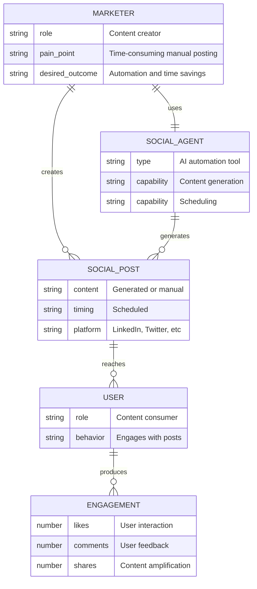
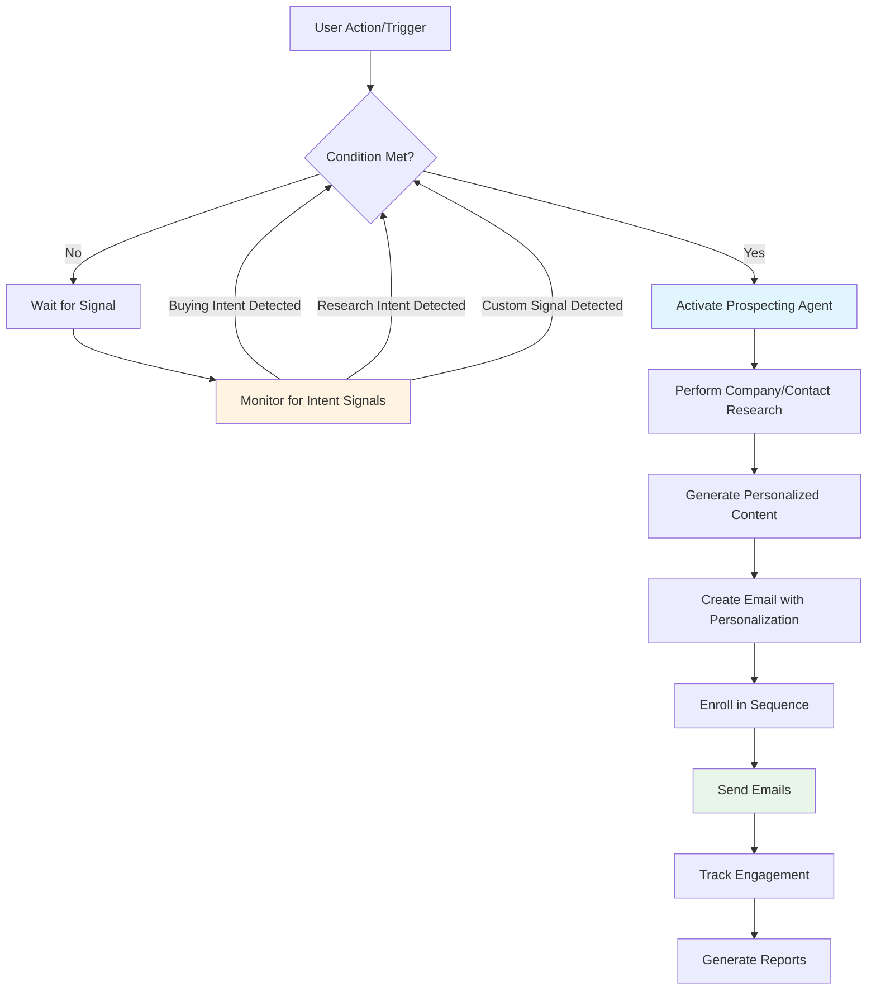
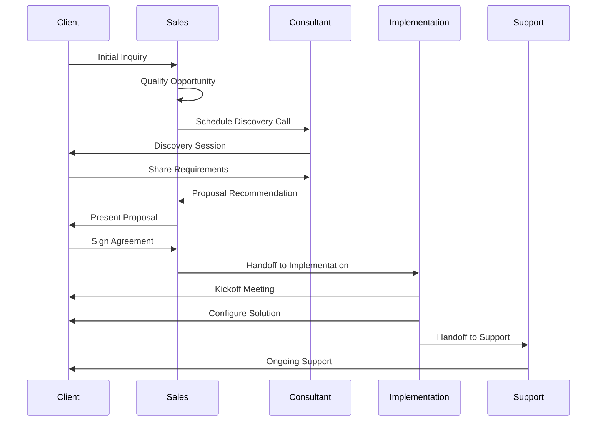
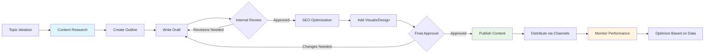
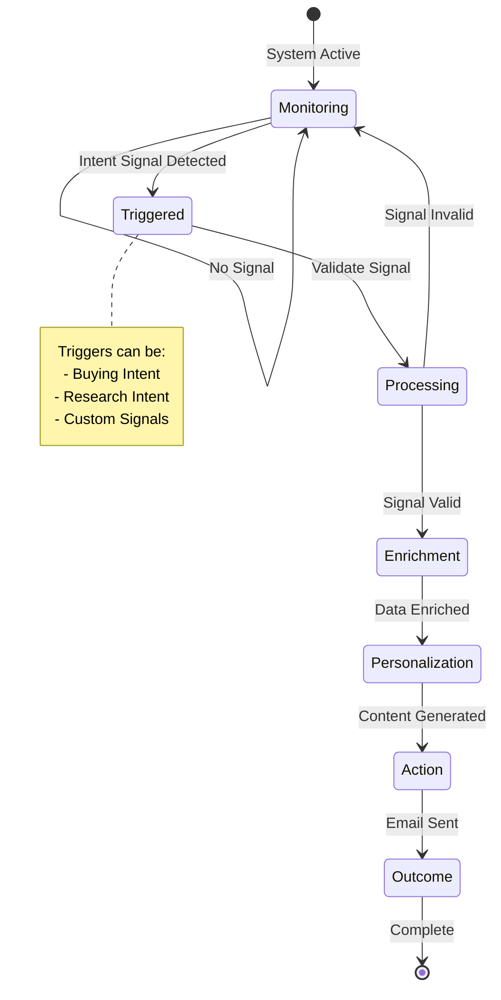

# Blog Post Content Research Skill

## Purpose

This skill performs **pure content research** for blog posts. It uses MCP_DOCKER tools to:
- Research content using web_search_exa and Perplexity
- Analyze competitor articles for content insights (NOT SEO structure)
- Validate facts and find authoritative statistics
- Identify content gaps and opportunities
- **Document architecture** to clarify relationships between entities/concepts
- **Create workflow diagrams** to visualize processes and decision flows
- Create Entity Relationship Diagram (ERD) to prevent entity mismatches
- Generate comprehensive content research document

**What This Skill Does:**
✅ Content research with web_search_exa and Perplexity
✅ Competitor content analysis (angles, topics, insights)
✅ Fact-checking and source validation
✅ **Architecture mapping** (relationship clarity, boundary definition, misconception identification)
✅ **Workflow visualization** with Mermaid diagrams (flowcharts, sequence, state)
✅ Entity mapping with Mermaid ERD
✅ Content gap identification

**What This Skill Does NOT Do:**
❌ SEO pre-research (DataForSEO keyword research, SERP analysis) - use `blog-post-seo-research` skill
❌ SEO competitor analysis (H2/H3 structure, meta tags, schema) - handled in blog-post-creation
❌ Drafting - handled in blog-post-creation
❌ Editing - handled in blog-post-creation

---

## Required Inputs

### Input #1: The Brief (MANDATORY)
- Topic and angle
- Target keyword
- Target audience
- Content focus areas
- Desired outcomes

### Input #2: Target Keyword (MANDATORY)
- Primary keyword to research
- Used for targeted content searches

**⚠️ IF MISSING:**
Ask user: "I need the brief and target keyword to proceed. Please provide both."

---

## Content Research Workflow

### Phase 1: Planning & Setup

**Step 1.1: Review Brief**
- Read the entire brief carefully
- Extract topic, keyword, audience, and focus areas
- Identify key questions to answer through research
- Note any specific content requirements

**Step 1.2: Plan Research Strategy**
- List 4-6 specific search queries to execute
- Identify research goals (statistics needed, topics to explore, facts to validate)
- Plan competitor content analysis approach
- Map out entity identification strategy

**Research Planning Template:**
```
Brief Summary:
- Topic: [topic]
- Keyword: [keyword]
- Target Audience: [audience]
- Content Focus: [focus areas]

Research Queries Planned:
1. web_search_exa("[keyword] 2025", numResults=5)
2. web_search_exa("[keyword] best practices guide", numResults=5)
3. web_search_exa("[related topic] trends", numResults=5)
4. web_search_exa("[industry] statistics 2025", numResults=5)

Research Goals:
- Find: [specific statistics needed]
- Validate: [facts to check]
- Explore: [topics to research]
- Analyze: [competitor angles]
```

---

### Phase 2: Content Research

> **📋 For MAN Digital brand context, see: `guidelines/MAN-DIGITAL-BRAND-CONTEXT.md`**
> Reference this document to ensure research aligns with MAN Digital's differentiators, services, and client profile.

**Step 2.1: Primary Content Research (web_search_exa)**

**Tool:** `mcp__MCP_DOCKER__web_search_exa`

Execute 4-6 targeted searches:

```
Search 1: web_search_exa("[keyword] 2025", numResults=5)
→ Purpose: Find latest content on primary topic

Search 2: web_search_exa("[keyword] guide best practices", numResults=5)
→ Purpose: Identify how-to content and practical approaches

Search 3: web_search_exa("[related topic] trends statistics", numResults=5)
→ Purpose: Find current trends and data

Search 4: web_search_exa("[industry] [keyword] case studies", numResults=5)
→ Purpose: Find real-world examples and outcomes

Search 5: web_search_exa("[product/tool] features updates", numResults=5)
→ Purpose: Find latest product information (if applicable)

Search 6: web_search_exa("[problem] solutions", numResults=5)
→ Purpose: Identify pain points and solutions
```

**For Each Search Result:**
- Note URL, title, and publication date
- Extract key insights and unique angles
- Identify relevant statistics (with sources)
- Note content gaps or missing perspectives
- Flag outdated information (pre-2024)

**Step 2.2: Deep Research (perplexity_research)**

**Tool:** `mcp__MCP_DOCKER__perplexity_research`

Use for complex topics requiring multiple authoritative sources:

```python
perplexity_research({
  "messages": [
    {
      "role": "user",
      "content": "What are the latest statistics on [topic] for 2025? Focus on [specific aspects]. Include only authoritative sources like research firms, industry leaders, and major publications."
    }
  ]
})
```

**Use Cases:**
- Market size and growth statistics
- Industry adoption rates
- ROI and business impact data
- Technology trends and predictions
- Comprehensive topic overviews

**Step 2.3: Fact Validation (perplexity_reason)**

**Tool:** `mcp__MCP_DOCKER__perplexity_reason`

Verify critical claims and statistics:

```python
perplexity_reason({
  "messages": [
    {
      "role": "user",
      "content": "Verify this claim: '[specific claim or statistic]'. Provide reasoning, confirm accuracy, and cite authoritative sources."
    }
  ]
})
```

**Validate:**
- All statistics found in web searches
- Product claims and feature descriptions
- Industry trends and predictions
- Technical accuracy of concepts

---

### Phase 3: Competitor Content Analysis

**Purpose:** Analyze competitor articles for CONTENT insights (not SEO structure)

**Step 3.1: Select Top Articles**

From web_search_exa results, select 5-7 top articles:
- Prefer recent publications (last 6-12 months)
- Prioritize authoritative sources
- Include diverse perspectives

**Step 3.2: Analyze Content (Not SEO)**

For each selected article, analyze:

**Content Analysis (NOT SEO Structure):**
- **Unique Angle:** What perspective does this article take?
- **Key Insights:** What are the main takeaways?
- **Statistics Used:** What data points are cited? (with sources)
- **Content Depth:** How deeply does it cover the topic?
- **Examples/Case Studies:** What real-world examples are used?
- **Topics Covered:** What subtopics are addressed?
- **Gaps Identified:** What's missing or could be improved?

**Document in Content Analysis Template:**
```
Article 1: [Title] - [URL]
Published: [Date]
Source: [Domain]

Unique Angle:
- [perspective/approach]

Key Insights:
- [insight 1]
- [insight 2]
- [insight 3]

Statistics Found:
- [statistic 1] - Source: [original source]
- [statistic 2] - Source: [original source]

Topics Covered:
- [topic A]
- [topic B]
- [topic C]

Content Gaps Identified:
- [missing topic 1]
- [shallow coverage of topic 2]
- [outdated information on topic 3]
```

**Step 3.3: Cross-Article Pattern Analysis**

After analyzing all articles, identify:

**Universal Topics (All articles cover):**
- [topic 1] - Must-include topic
- [topic 2] - Must-include topic
- [topic 3] - Must-include topic

**Common Angles:**
- [angle 1] - Frequency: 5/7 articles
- [angle 2] - Frequency: 4/7 articles

**Content Gaps (Opportunities):**
- [gap 1] - NONE of the articles cover this
- [gap 2] - Only 1 article mentions this briefly
- [gap 3] - All articles have outdated info (pre-2024)

**Statistics Summary:**
- Most cited sources: [list authoritative sources found]
- Common data points: [list frequently cited statistics]
- Missing data: [statistics we need to find]

---

### Phase 4: Source Authority Validation

> **📋 For source authority hierarchy, see: `references/planning-framework.md`**

**Step 4.1: Review All Statistics Found**

For EVERY statistic you plan to use:
- [ ] Is the source a recognized authority? (Tier 1 or 2)
- [ ] Is this the ORIGINAL source? (not citing someone else)
- [ ] Is the data current? (2024-2025 preferred)
- [ ] Would I trust this source as a reader?

**Authority Hierarchy:**

**Tier 1 - ALWAYS ACCEPTABLE:**
- Research firms: Forrester, Gartner, McKinsey, Deloitte
- Academic: Harvard Business Review, MIT, Stanford research
- Industry leaders: HubSpot Research, Salesforce, Adobe
- Major publications: Forbes, Wall Street Journal, Bloomberg

**Tier 2 - ACCEPTABLE:**
- Established industry publications: MarketingProfs, TechCrunch
- Known SaaS blogs: Intercom, Drift (for their domain)
- Recognized analysts: Nielsen, Statista

**Tier 3 - AVOID:**
- Unknown blogs
- Content farms
- Secondary sources citing primary sources

**Step 4.2: Trace to Original Sources**

For each statistic:
```
Found: "[statistic]" from unknownblog.com
→ Check article: "According to [Original Source] report..."
→ Verify with original: Use web_search_exa to find original report
→ Cite correctly: "Source: [Original Source]"
```

**Step 4.3: Track Domain Usage**

**CRITICAL: Each domain used ONCE only**

```
DOMAIN TRACKING:
- hubspot.com ✓ (used for statistic about AI adoption)
- forrester.com ✓ (used for ROI statistic)
- mckinsey.com ✓ (used for productivity statistic)
- salesforce.com ❌ (not yet used - available)
```

---

### Phase 5: Architecture, Workflow & Entity Mapping (MANDATORY)

> **This is CRITICAL to prevent misunderstandings, entity conflation, and relationship misattribution in the final blog post**

**Why Architecture & Workflow Matter:**

Understanding HOW things connect, work together, and relate to each other is essential for accurate content. Without clear architecture and workflow mapping, we risk:
- **Conflating separate entities** that merely work together or relate to each other
- **Misattributing characteristics, capabilities, or actions** to the wrong entity
- **Confusing relationship types and boundaries** between connected entities
- **Creating false equivalencies** between different concepts

**This applies universally across ALL domains:**

Whether you're researching software tools, business partnerships, organizational structures, funding models, events, content strategies, services, people, processes, or any other topic - you must understand:

1. **What each entity IS** (its essential nature and boundaries)
2. **How entities RELATE** (the nature of connections between them)
3. **What INITIATES or ENABLES** actions and outcomes
4. **What are the PREREQUISITES** or foundations
5. **What are COMMON MISCONCEPTIONS** about relationships

**The goal:** Ensure the blog post creator has a clear mental model of how everything fits together, preventing misrepresentation and confusion.

---

**Step 5.1: Identify All Entities & Components**

**IMPORTANT:** The categories below are EXAMPLES only. Your job is to identify what entities are relevant to YOUR specific topic. The categories will vary dramatically based on what you're researching.

**For your specific topic, identify:**

**Primary Entities:**
- What are the main "things" (people, organizations, tools, concepts, events, etc.) that matter in this topic?
- What are their essential characteristics?

**Secondary Entities:**
- What supporting entities exist?
- What additional players, factors, or elements are involved?

**Ask yourself these universal questions:**

1. **WHO/WHAT questions:**
   - Who or what are the key players/participants/actors?
   - What tools, systems, methods, or concepts are involved?
   - What outcomes, results, or impacts occur?

2. **RELATIONSHIP questions:**
   - Which entities are closely connected? How?
   - Which entities are often confused with each other? Why?
   - Which entities work together vs. which are separate?

3. **BOUNDARY questions:**
   - Where does one entity end and another begin?
   - What belongs TO an entity vs. what WORKS WITH it?
   - What REQUIRES something vs. what INCLUDES something?

4. **MISCONCEPTION questions:**
   - What do people commonly get wrong about these relationships?
   - What false assumptions exist?
   - What gets unfairly lumped together or separated?

**Entity identification will look different for each topic:**

**THESE ARE ILLUSTRATIVE EXAMPLES ONLY** - to show you the breadth of possibilities. Your topic may have completely different entity types. Think critically about YOUR specific topic.

- Software/Tech: Tools, features, integrations, users, processes, APIs, triggers, platforms
- Business/Partnerships: Companies, alliances, revenue models, stakeholders, agreements, channels
- People/Roles: Individuals, teams, organizations, responsibilities, hierarchies, influencers
- Events/Conferences: Speakers, attendees, sponsors, sessions, venues, formats, outcomes
- Content/Media: Formats, channels, creators, audiences, strategies, distribution, engagement
- Funding/Investment: Investors, companies, rounds, terms, valuations, stages, instruments
- Services/Offerings: Providers, clients, deliverables, pricing models, support, SLAs
- Regulations/Compliance: Rules, governing bodies, requirements, certifications, audits, penalties
- Research/Science: Studies, researchers, institutions, methodologies, findings, publications
- Supply Chain/Logistics: Suppliers, manufacturers, distributors, retailers, inventory, transportation
- Healthcare/Medical: Providers, patients, treatments, facilities, insurance, regulations
- Education/Training: Instructors, students, curricula, institutions, certifications, methodologies
- Real Estate/Property: Properties, buyers, sellers, agents, financing, zoning, development
- Legal/Contracts: Parties, agreements, clauses, jurisdictions, enforcement, disputes

**The list above is NOT exhaustive.** Your topic might involve:
- Marketing campaigns and their components
- Customer journeys and touchpoints
- Product launches and their phases
- Mergers and acquisitions
- Crisis management protocols
- Innovation ecosystems
- Community programs
- Sustainability initiatives
- Brand positioning frameworks
- Risk management strategies
- Or something completely different!

**Your goal:** Identify ALL entities that matter to YOUR specific topic - whether they fit these categories or not. Don't force your topic into these boxes. Let the entities emerge naturally from your research.

**Step 5.2: Document Architecture & Relationships**

**CRITICAL: Map how entities connect and relate to each other**

For each major entity, understand and document its relationships with other entities. **The types of relationships will vary based on your topic.**

**Universal relationship mapping questions:**

1. **Intrinsic vs External:**
   - What is INHERENT to this entity? (its essential nature)
   - What is EXTERNAL but connected? (separate entities that relate)

2. **Boundary Clarity:**
   - Where does this entity END and another BEGIN?
   - What belongs TO it vs what CONNECTS WITH it?
   - What is it vs what does it ENABLE or USE?

3. **Nature of Connections:**
   - How are entities CONNECTED? (What's the relationship type?)
   - Is it: ownership, partnership, dependency, causation, enablement, collaboration, competition, hierarchy, sequence, conditionality, or something else?

4. **Directionality:**
   - Is the relationship ONE-WAY or TWO-WAY?
   - Which entity influences/affects/initiates/depends on the other?
   - What's the flow of value, data, control, or resources?

5. **Conditionality:**
   - Are relationships ALWAYS true or CONDITIONAL?
   - What must be true for the relationship to exist?
   - What changes the nature of the relationship?

6. **Common Misunderstandings:**
   - What do people WRONGLY assume about this relationship?
   - What gets CONFLATED that should be separate?
   - What gets SEPARATED that should be together?

**Architecture Documentation Template:**

**Adapt this structure to YOUR topic. The relationship categories below are flexible - use what makes sense for your domain.**

```
Entity: [Name of entity]

Essential Nature: [What this entity fundamentally IS - one sentence]

Intrinsic Characteristics:
├── [What inherently belongs to/defines this entity]
├── [What is inseparable from it]
└── [What makes it what it is]

Connected Entities (and relationship type):
├── [Entity A] - [Relationship: e.g., enables, requires, partners with, competes with, reports to, funds, produces, consumes, etc.]
├── [Entity B] - [Relationship type]
└── [Entity C] - [Relationship type]

Conditional Relationships:
├── IF [condition], THEN [this entity] → [relates to] → [that entity]
└── WHEN [situation], [entity A] and [entity B] interact as: [description]

Directional Flows:
├── [Entity] → provides/delivers/sends → [value/data/resource] → to [Entity]
├── [Entity] ← receives/depends on/requires ← [value/data/resource] ← from [Entity]

Common Misconceptions:
├── ❌ WRONG: [common false belief about this entity or its relationships]
│   ✅ CORRECT: [accurate understanding]
├── ❌ WRONG: [another misconception]
│   ✅ CORRECT: [correction]
```

**Architecture Documentation Examples:**

**⚠️ IMPORTANT: These are ILLUSTRATIVE EXAMPLES ONLY** to show you how relationship mapping works across different domains. Your documentation will look different based on YOUR specific topic. Don't copy these structures - adapt the concept to your needs.

---

**Example 1: Funding/Investment Domain**
```
Entity: Series B Funding Round

Essential Nature: Mid-stage venture capital investment event where companies raise $10M-$50M to scale operations

Intrinsic Characteristics:
├── Equity dilution (founders give up ownership percentage)
├── Board seat allocation (investors gain governance rights)
└── Milestone-based tranches (capital released in stages)

Connected Entities (and relationship types):
├── Lead Investor → provides → majority of capital → drives terms
├── Participating Investors → contribute → remaining capital → follow lead's terms
├── Company → receives → capital → in exchange for → equity
├── Existing Shareholders → experience → dilution
├── Series A Round → precedes → establishes valuation baseline
├── Series C Round → follows → if growth targets met

Common Misconceptions:
├── ❌ WRONG: "Series B funding includes Series A investors"
│   ✅ CORRECT: Series A investors may participate in Series B, but they are separate funding events with different terms
├── ❌ WRONG: "The company owns the Series B funding"
│   ✅ CORRECT: Investors own equity received; company receives and deploys capital
```

---

**Example 2: People/Organization Domain**
```
Entity: Chief Revenue Officer (CRO)

Essential Nature: Executive responsible for all revenue-generating functions across sales, marketing, and customer success

Intrinsic Characteristics:
├── Strategic revenue planning authority
├── Cross-functional leadership responsibility
└── Board-level reporting obligations

Connected Entities (and relationship types):
├── CEO → CRO reports to → provides strategic direction
├── VP Sales → reports to → CRO → manages sales execution
├── VP Marketing → reports to → CRO → manages demand generation
├── VP Customer Success → reports to → CRO → manages retention/expansion
├── CFO → collaborates with → CRO → on revenue forecasting
├── Board of Directors ← receives reports from ← CRO → on revenue performance

Conditional Relationships:
├── IF company < $50M revenue, THEN CRO may also manage → Sales directly
└── WHEN CRO is hired externally, existing VPs may → report to → or → depart

Common Misconceptions:
├── ❌ WRONG: "CRO is just a fancy title for VP Sales"
│   ✅ CORRECT: CRO oversees all revenue functions; VP Sales manages only sales team
├── ❌ WRONG: "Marketing doesn't report to CRO"
│   ✅ CORRECT: In revenue-focused orgs, marketing typically reports to CRO
```

---

**Example 3: Event/Conference Domain**
```
Entity: Annual Industry Conference (3-day event)

Essential Nature: Multi-day gathering bringing together professionals, vendors, and thought leaders for education, networking, and business development

Intrinsic Characteristics:
├── Keynote presentations (main stage content)
├── Breakout sessions (specialized tracks)
├── Expo hall (vendor booths)
└── Networking events (structured and informal)

Connected Entities (and relationship types):
├── Organizing Body → produces → event → collects revenue from registrations/sponsorships
├── Attendees → pay → registration fees → receive → access to content/networking
├── Sponsors → pay → sponsorship fees → receive → brand visibility/lead generation
├── Speakers → deliver → content → receive → speaking fees or exposure
├── Venue → provides → physical space → receives → rental fees
├── Media Partners → promote → event → receive → content access/brand association

Directional Flows:
├── Sponsors → provide → funding → to → Organizing Body
├── Organizing Body → provides → attendee data → to → Sponsors (with consent)
├── Speakers → deliver → value/content → to → Attendees
├── Attendees → generate → networking opportunities → for → each other

Common Misconceptions:
├── ❌ WRONG: "Sponsors are part of the conference organizing team"
│   ✅ CORRECT: Sponsors are external entities paying for visibility; organizers are separate
├── ❌ WRONG: "All speakers are paid by the conference"
│   ✅ CORRECT: Some speak for exposure; some are paid; some sponsor to speak
```

---

**Your documentation should:**
- Identify what's unique to your topic
- Map the actual relationships that exist
- Clarify common confusions specific to your domain
- Not force-fit these example structures

**Step 5.3: Create Mermaid Entity Relationship Diagram**

**MANDATORY: Create a comprehensive ERD**



**ERD Must Show:**
- All primary entities
- Relationships between entities (creates, uses, generates, etc.)
- Entity attributes (what defines each entity)
- Statistical attribution (which stats apply to which entities)

---

**Step 5.4: Create Workflow/Process Diagrams (MANDATORY)**

**Why Workflow Diagrams Matter:**

Workflow diagrams visualize HOW processes unfold over time, showing:
- Sequence of events and actions
- Decision points and branches
- Trigger conditions and initiators
- Dependencies and prerequisites
- Integration points and handoffs

**Create workflow diagrams using Mermaid flowcharts or sequence diagrams.**

**Workflow Diagram Guidelines:**

Choose the appropriate diagram type:
- **Flowchart:** For decision trees, process flows, conditional logic
- **Sequence Diagram:** For interactions between entities over time
- **State Diagram:** For status changes and lifecycle stages
- **Journey Map:** For user/customer experiences

**Example 1: Software Tool Workflow (Flowchart)**



**Example 2: Business Process Workflow (Sequence Diagram)**



**Example 3: Content Production Workflow**



**Example 4: Trigger-Based Workflow**



**Your Workflow Diagram Must Show:**

1. **Entry Points:** How does the process begin? (trigger, manual start, scheduled)
2. **Key Steps:** What are the main actions/stages?
3. **Decision Points:** Where do choices/branches occur?
4. **Integrations:** Where do external systems connect?
5. **Triggers:** What initiates different paths?
6. **Dependencies:** What must happen before next step?
7. **Outcomes:** What are the possible endpoints?

**Workflow Documentation Template:**

```
Workflow: [Name of process/workflow]

Purpose: [What this workflow accomplishes]

Entry Points:
├── [Trigger 1] - Automated start condition
├── [Trigger 2] - Manual initiation
└── [Trigger 3] - Scheduled/time-based

Key Stages:
1. [Stage 1] - [Description]
2. [Stage 2] - [Description]
3. [Stage 3] - [Description]

Decision Points:
├── [Decision 1] - Condition: [criteria]
│   ├── Path A: [outcome if true]
│   └── Path B: [outcome if false]
└── [Decision 2] - Condition: [criteria]
    ├── Path A: [outcome if true]
    └── Path B: [outcome if false]

Integration Points:
├── [System 1] - Data exchange at [stage]
├── [System 2] - Triggers action at [stage]
└── [System 3] - Receives output at [stage]

Outcomes:
├── [Success Outcome] - Process completes successfully
├── [Alternative Outcome] - Alternative completion path
└── [Exception Outcome] - Error handling / fallback
```

---

**Step 5.5: Document Entity-Statistic Mapping**

For EACH statistic found, document which entity it describes:

```
Entity-Statistic Mapping:

Statistic: "Teams spend 15-20 hours weekly on social scheduling"
→ Entity: MARKETER (creators, not consumers)
→ Context: Time spent creating/scheduling content
→ Valid Usage: Discussing marketer pain points

Statistic: "Users spend 2.5 hours daily on social media"
→ Entity: USER (consumers, not creators)
→ Context: Time spent consuming content
→ Valid Usage: Discussing audience reach, NOT marketer tools

Statistic: "AI tools reduce content creation time by 70%"
→ Entity: SOCIAL_AGENT (tool capability)
→ Context: Tool effectiveness
→ Valid Usage: Discussing automation benefits for MARKETERS
```

**Step 5.6: Identify Entity Mismatch Risks**

Flag statistics that could be misattributed:

```
⚠️ RISK: "2.5 hours daily on social platforms"
→ This describes USER behavior (consuming content)
→ DO NOT use to describe MARKETER tools (creating content)
→ Find alternative: Marketer time spent on content creation

✅ SAFE: "15-20 hours weekly on scheduling"
→ This describes MARKETER activity (creating/scheduling)
→ CAN use to describe automation tools for marketers
→ Matches entity context correctly
```

**Step 5.7: Architecture & Workflow Quality Check**

Before proceeding to Phase 6, verify:

**Architecture Documentation:**
- [ ] Core components clearly identified (what's built-in)
- [ ] Integrations/extensions documented (what's optional)
- [ ] Triggers/initiators mapped (what activates functionality)
- [ ] Dependencies listed (what's required)
- [ ] Relationships clarified (what connects/relates)

**Workflow Visualization:**
- [ ] Workflow diagram created (flowchart, sequence, or state diagram)
- [ ] Entry points documented
- [ ] Key stages/steps identified
- [ ] Decision points shown
- [ ] Integration points mapped
- [ ] Triggers illustrated
- [ ] Outcomes/endpoints defined

**Common Architecture Pitfalls:**
❌ Saying "X includes Y" when Y is actually a trigger for X
❌ Claiming "Feature is part of Tool" when it's a separate integration
❌ Confusing "works with" and "requires"
❌ Not distinguishing core vs optional capabilities
❌ Missing the workflow sequence and decision logic

---

### Phase 6: Content Research Output Document

**Step 6.1: Compile Comprehensive Research Document**

Create a structured document with all findings:

**Content Research Document Template:**

```markdown
# Content Research: [Topic/Keyword]
Generated: [Date]
Keyword: [primary keyword]

## Executive Summary

Brief overview of research findings (3-4 sentences):
- Key insight 1
- Key insight 2
- Key insight 3

---

## Research Queries Executed

1. web_search_exa("[query 1]", numResults=5)
   - Results: [number] articles analyzed
   - Key findings: [summary]

2. web_search_exa("[query 2]", numResults=5)
   - Results: [number] articles analyzed
   - Key findings: [summary]

[Continue for all queries]

---

## Statistics & Sources (Authority-Validated)

### Statistic 1: [Statistic Text]
- **Source:** [Original Authoritative Source]
- **Authority Tier:** Tier 1 / Tier 2
- **Date:** [Year]
- **Entity:** [Which entity this describes]
- **Context:** [When to use this stat]
- **URL:** [link if available]

### Statistic 2: [Statistic Text]
- **Source:** [Original Authoritative Source]
- **Authority Tier:** Tier 1 / Tier 2
- **Date:** [Year]
- **Entity:** [Which entity this describes]
- **Context:** [When to use this stat]
- **URL:** [link if available]

[Continue for all statistics]

**Domain Usage Tracking:**
- domain1.com ✓ (used once)
- domain2.com ✓ (used once)
- domain3.com ✓ (used once)

---

## Competitor Content Analysis

### Universal Topics (Must Include):
1. [Topic A] - ALL articles cover this
2. [Topic B] - ALL articles cover this
3. [Topic C] - ALL articles cover this

### Common Content Angles:
1. [Angle 1] - Used by 5/7 articles
2. [Angle 2] - Used by 4/7 articles
3. [Angle 3] - Used by 3/7 articles

### Content Gaps (Differentiation Opportunities):
1. [Gap 1] - NONE of the articles cover this
2. [Gap 2] - Only 1 article mentions this
3. [Gap 3] - Outdated information (pre-2024) across all articles

### Key Insights from Competitors:
- Insight 1: [finding]
- Insight 2: [finding]
- Insight 3: [finding]

### Competitor Articles Analyzed:
1. [Title] - [URL] - [Date] - [Source]
2. [Title] - [URL] - [Date] - [Source]
3. [Title] - [URL] - [Date] - [Source]
[Continue for all analyzed articles]

---

## Architecture Documentation

### System/Concept Overview
[Brief description of main entity/system/concept being researched]

### Core Components (Part Of)
- [Component 1] - Native, built-in capability
- [Component 2] - Core feature, always included
- [Component 3] - Intrinsic functionality

### Integrations (Works With)
- [Integration 1] - Third-party connection, optional
- [Integration 2] - Partner tool, requires configuration
- [Integration 3] - External system, separate

### Triggers (Triggered By / Enables)
- [Trigger 1] - Initiates when [condition]
- [Trigger 2] - Activates upon [signal]
- [Trigger 3] - Starts when [event occurs]

### Dependencies (Requires)
- [Dependency 1] - Must have [foundation]
- [Dependency 2] - Prerequisite [system/feature]
- [Dependency 3] - Required [condition]

### Relationships (Relates To)
- [Entity 1] - Partnership, data sharing
- [Entity 2] - Complementary tool/service
- [Entity 3] - Ecosystem connection

**⚠️ Common Misconceptions Identified:**
- ❌ WRONG: [common misunderstanding]
- ✅ CORRECT: [accurate understanding]

---

## Workflow Diagram

```mermaid
[flowchart/sequenceDiagram/stateDiagram]
    [Include complete workflow diagram created in Phase 5]
```

### Workflow Description

**Purpose:** [What this workflow accomplishes]

**Entry Points:**
- [Trigger/start point 1]
- [Trigger/start point 2]

**Key Stages:**
1. [Stage 1] - [Description]
2. [Stage 2] - [Description]
3. [Stage 3] - [Description]

**Decision Points:**
- [Decision 1]: If [condition], then [outcome A], else [outcome B]
- [Decision 2]: If [condition], then [outcome A], else [outcome B]

**Integration Points:**
- [Stage X]: Connects with [system/tool]
- [Stage Y]: Data exchange with [external source]

**Outcomes:**
- ✅ [Success outcome]
- ⚠️ [Alternative outcome]
- ❌ [Exception/error outcome]

---

## Entity Relationship Diagram

```mermaid
erDiagram
    [Include the complete ERD created in Phase 5]
```

---

## Entity-Statistic Mapping

### Entity 1: [Entity Name]
**Description:** [What this entity is]

**Statistics That Apply:**
- [Statistic 1] - Context: [how it relates]
- [Statistic 2] - Context: [how it relates]

**Statistics That DON'T Apply:**
- ⚠️ [Statistic X] - This describes [different entity], not this one

### Entity 2: [Entity Name]
**Description:** [What this entity is]

**Statistics That Apply:**
- [Statistic 1] - Context: [how it relates]
- [Statistic 2] - Context: [how it relates]

[Continue for all entities]

---

## Content Recommendations

### Topics to Cover:
1. [Topic 1] - Priority: High (universal topic)
2. [Topic 2] - Priority: High (universal topic)
3. [Topic 3] - Priority: Medium (common angle)
4. [Topic 4] - Priority: Medium (gap opportunity)

### Unique Angles to Take:
1. [Angle 1] - Why: [differentiation opportunity]
2. [Angle 2] - Why: [fills content gap]
3. [Angle 3] - Why: [recent development]

### Statistics to Emphasize:
1. [Statistic 1] - Why: [strong authority, recent, impactful]
2. [Statistic 2] - Why: [supports main argument]
3. [Statistic 3] - Why: [competitive differentiation]

### Content Gaps to Fill:
1. [Gap 1] - How: [approach]
2. [Gap 2] - How: [approach]
3. [Gap 3] - How: [approach]

---

## MAN Digital Brand Alignment

> Based on: `guidelines/MAN-DIGITAL-BRAND-CONTEXT.md`

**Target Audience Confirmation:**
- ✅ Speaks to: [decision maker type]
- ✅ Client Profile: [firm size/type]
- ✅ Pain Points Addressed: [which ones]

**Service Connection:**
- Relates to: [MAN Digital service(s)]
- Differentiator: [unique approach]

**Positioning:**
- RevOps Angle: [how we position this]
- HubSpot Context: [enabler, not hero]

---

## Research Tools Used

- ✅ web_search_exa: [X] queries executed
- ✅ perplexity_research: [X] deep research requests
- ✅ perplexity_reason: [X] fact-checks performed
- ✅ web_fetch: [X] articles scraped (if used)

---

## Next Steps for Blog Post Creation

This content research document should be provided to the **blog-post-creation** skill along with:
1. The original brief
2. SEO research file (from blog-post-seo-research skill)

The blog-post-creation skill will:
- Digest all inputs (brief, SEO research, content research + architecture + workflow + ERD)
- Use architecture to ensure accurate representation of relationships and prevent conflation
- Reference workflow diagrams to explain processes correctly
- Organize information for drafting
- Create the draft incorporating all research findings
- Apply 11-step editing framework
```

**Step 6.2: Save Content Research Document**

Save as: `content-research-[keyword]-[date].md`

Example: `content-research-hubspot-social-agent-2025-01-15.md`

---

## Quality Checklist

Before marking content research complete:

**Research Completeness:**
- [ ] 4-6 web_search_exa queries executed
- [ ] perplexity_research used for deep topics
- [ ] perplexity_reason used for fact validation
- [ ] 5-7 competitor articles analyzed for content

**Source Authority:**
- [ ] All statistics from Tier 1 or Tier 2 sources
- [ ] All statistics traced to original authoritative sources
- [ ] All statistics dated 2024-2025 (current)
- [ ] Each domain used only once (tracking completed)

**Architecture & Workflow:**
- [ ] Architecture documented (core, integrations, triggers, dependencies, relationships)
- [ ] "Part of" vs "works with" vs "triggered by" relationships clarified
- [ ] Workflow diagram created (Mermaid flowchart/sequence/state diagram)
- [ ] Entry points, decision points, and outcomes mapped
- [ ] Common misconceptions identified and corrected

**Entity Mapping:**
- [ ] All entities identified (actors, tools, processes, outcomes, triggers, etc.)
- [ ] Entity relationships documented
- [ ] Mermaid ERD created (comprehensive)
- [ ] Entity-statistic mapping completed
- [ ] Entity mismatch risks flagged

**Content Analysis:**
- [ ] Universal topics identified (must-include list)
- [ ] Common angles documented
- [ ] Content gaps identified (differentiation opportunities)
- [ ] Key insights extracted from competitors

**Output Document:**
- [ ] Comprehensive content research document created
- [ ] All sections completed (statistics, architecture, workflow, ERD, recommendations)
- [ ] Document saved with proper naming convention
- [ ] Ready to provide to blog-post-creation skill

---

## Common Mistakes to Avoid

### Research Phase Mistakes:
1. **Insufficient searches** - Less than 4 web_search_exa queries
2. **Not using Perplexity** - Skipping deep research and fact-checking
3. **Analyzing too few competitors** - Less than 5 articles analyzed
4. **Outdated content** - Including pre-2024 statistics
5. **Wrong tool names** - Using incorrect MCP tool syntax

### Source Validation Mistakes:
6. **Low-authority sources** - Citing Tier 3 blogs instead of authoritative sources
7. **Secondary sources** - Citing blogs that quote original sources instead of going direct
8. **No source tracing** - Not verifying original authoritative sources
9. **Reusing domains** - Using same domain multiple times (violation: use once only)
10. **Missing publication dates** - Not noting when statistics were published

### Architecture & Workflow Mistakes:
11. **Skipping architecture** - Not documenting what's "part of" vs "works with" vs "triggered by"
12. **Conflating relationships** - Saying "X includes Y" when Y actually triggers X
13. **Missing workflow diagram** - Not creating Mermaid visualization (MANDATORY)
14. **No decision points** - Workflow missing conditional logic and branches
15. **Unclear triggers** - Not identifying what initiates processes
16. **Missing dependencies** - Not documenting prerequisites and requirements
17. **No common misconceptions** - Not identifying and correcting misunderstandings

### Entity Mapping Mistakes:
18. **Skipping ERD** - Not creating the Mermaid diagram (MANDATORY)
19. **Incomplete entity identification** - Missing key actors, tools, processes, or triggers
20. **No entity-statistic mapping** - Not documenting which stats apply to which entities
21. **Missing mismatch risks** - Not flagging statistics that could be misattributed

### Content Analysis Mistakes:
22. **Confusing content with SEO** - Analyzing H2/H3 structure instead of content insights
23. **No gap identification** - Not finding differentiation opportunities
24. **Missing universal topics** - Not identifying must-include topics from all competitors
25. **Shallow analysis** - Not extracting key insights from competitor articles

### Output Mistakes:
26. **Incomplete document** - Missing sections (architecture, workflow, ERD) in research output
27. **No recommendations** - Not providing actionable content guidance
28. **Poor organization** - Document hard to navigate or understand
29. **Missing diagrams** - Not including architecture, workflow, and ERD visualizations

---

## References

- `references/planning-framework.md` - Research planning and source authority hierarchy
- `guidelines/MAN-DIGITAL-BRAND-CONTEXT.md` - MAN Digital positioning and client profile
- `guidelines/SEO_guidelines.md` - SEO deliverables (for reference, not executed here)

---

## Output Deliverable

**File:** `content-research-[keyword]-[date].md`

**Contains:**
- Executive summary
- All statistics with validated authoritative sources
- **Architecture documentation** (core components, integrations, triggers, dependencies, relationships)
- **Workflow diagram** (Mermaid visualization with entry points, stages, decisions, outcomes)
- Entity Relationship Diagram (Mermaid ERD)
- Entity-statistic mapping
- Competitor content analysis
- Content gaps and opportunities
- Universal topics to cover
- Recommendations for blog post creation

**Key Additions in This Version:**
- **Architecture mapping** prevents conflation of "part of" vs "works with" vs "triggered by"
- **Workflow diagrams** visualize processes, triggers, decision points, and integration flows
- **Domain-agnostic approach** works for software, business partnerships, content strategies, events, and any topic

**To Be Used By:** `blog-post-creation` skill for drafting phase
