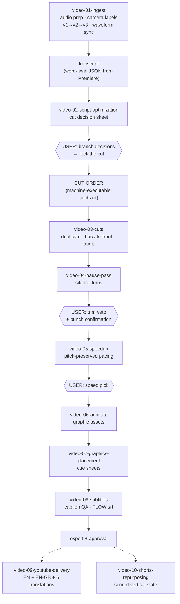

# Video Production Pipeline

Claude Code skills that run MAN Digital's video post-production — from raw two-camera
footage to a cut, paced, graphics-ready, subtitled timeline — by driving Adobe Premiere Pro
through the `premiere-pro-mcp` server.

Numbered skills are pipeline stages. `video-00-pipeline` conducts them: it detects the
current stage from the project folder's artifacts, chains the stages in order, and stops
only where a human decision is genuinely required. `video-09` and `video-10` are standalone
post-approval skills — they run on request only, after a video is approved.

| Skill | Role in one line |
|---|---|
| `video-00-pipeline` | Conductor — stage detection from artifacts, user gates, pipeline log |
| `video-01-ingest` | Post-import prep: mono audio mapping, camera color labels, v1→v2→v3 build, two-camera waveform sync |
| `video-02-script-optimization` | Transcript analysis → cut decision sheet → locked CUT ORDER; post-cut verification |
| `video-03-cuts` | Executes CUT ORDERs in Premiere via MCP under a strict safety protocol (duplicate first, back-to-front, read-back audit) |
| `video-04-pause-pass` | Tightens long pauses; masks seams with a simulated second-camera punch plan |
| `video-05-speedup` | Words-per-minute analysis → pitch-preserved 105–110% speed-up |
| `video-06-animate` | Web-tech animation + deterministic HTML→video export (MP4/ProRes) for timeline assets |
| `video-07-graphics-placement` | Maps assets onto the locked cut; dual-timecode cue sheets; texture pass |
| `video-08-subtitles` | Caption QA: DaVinci SRT cross-referenced against the Premiere word-confidence JSON; FLOW delivery version |
| `video-09-youtube-delivery` | Post-approval: punctuated verbatim EN + polished EN-GB + PL/DE/FR/ES/PT-PT/UA subtitle tracks |
| `video-10-shorts-repurposing` | Post-approval: mines the long-form transcript into a scored Shorts/LinkedIn vertical candidate slate |

## Installing

Copy the **individual skill folders** (not this wrapper) into your Claude Code skills
directory (`~/.claude/skills/`) — the folder name is the skill's invocation name, and the
`video-00` conductor references the stages by exactly these names, so don't rename them.
Read each skill's own `README.md` for scope, inputs, and outputs before using it.

## Prerequisites

- **Adobe Premiere Pro** driven via the `premiere-pro-mcp` server (CEP bridge; plus a UXP
  WebSocket bridge on `ws://localhost:7777/uxp` for automated transcript pull).
- **python3** for the helper scripts (`numpy` for the audio waveform sync; `ffmpeg`/`ffprobe`
  for audio analysis).
- **DaVinci Resolve** only for the caption export consumed by `video-08-subtitles`.
- A project folder following the numbered template layout (`03_Project_Files/`,
  `04_Project_Assets/Transcripts/`, `06_Final_Delivery/` …) — the conductor detects pipeline
  state from those artifacts.

## The safety model

Destructive timeline operations never run on the original sequence: `video-03-cuts`
duplicates first, executes back-to-front, and audits by read-back. The user gates in the
flowchart are formalized — the pipeline refuses to proceed past a gate without an explicit
decision, and everything that reaches a timeline is derived from a locked, checksummed
CUT ORDER rather than free-form judgment.
