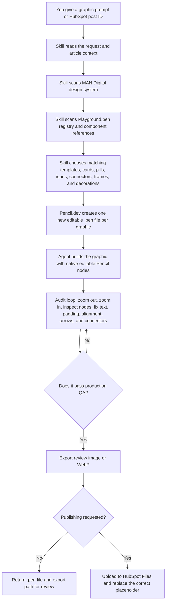

# MAN Digital Blog Graphics

Codex skill for creating production-grade, editable MAN Digital blog, article, HubSpot, RevOps, Open Graph, LinkedIn, A4, infographic, and web-page graphics in Pencil/Pencil.dev.

This skill is built for the Pencil.dev MCP workflow: the agent reads and edits `.pen` files through Pencil/LivePen, uses the MAN Digital Playground as the component library, and keeps final graphics editable as native Pencil layers. The bundled Playground copy gives the GitHub package a portable reference library, while the local `Playground.pen` remains the primary live working source when available.

## Plain-English Intro

Use this skill when you want Codex to make MAN Digital graphics that are still editable in Pencil.dev.

Instead of making a flat image that you cannot edit, the skill creates a real `.pen` file with editable text, cards, labels, icons, connectors, frames, decorations, and logo assets. It uses the MAN Digital design system and the Playground component library so new graphics feel consistent with the brand without all looking identical.

Typical uses:

- Blog post graphics.
- HubSpot article graphics from placeholder prompts.
- Open Graph and featured images.
- RevOps, HubSpot, CRM, GTM, lifecycle, and workflow diagrams.
- Infographics, A4 visuals, slide graphics, and web-page graphics.
- Carousel-derived visuals when the request is not a full LinkedIn carousel.

## What You Need Before Using It

You do not need to understand the internals, but these pieces need to exist:

1. **Codex or Claude with skills enabled.**
   This is where the skill is installed.

2. **Pencil.dev / LivePen available.**
   The skill works through Pencil.dev MCP. MCP is just the connection bridge that lets Codex create and edit `.pen` files instead of only exporting screenshots.

3. **The MAN Digital design system folder.**
   Default location:

   ```text
   /Users/romeoman/Documents/Marketing/Design/MAN Digital Design System
   ```

4. **The Playground component library.**
   Preferred live source:

   ```text
   /Users/romeoman/Documents/Marketing/Design/Pencil/Playground.pen
   ```

   The repo also includes a bundled copy at:

   ```text
   marketing/man-digital-blog-graphics/assets/playground/Playground.pen
   ```

   This bundled copy is a backup/reference so the skill package travels with the core component library.

5. **HubSpot access only if you want publishing.**
   You can use the skill without HubSpot. HubSpot is only needed when asking it to fetch a post, upload exported images, or replace placeholders in the blog post.

## How To Install

### Option A: Install With Finder

Use this if you do not want to touch Terminal.

1. Download or clone this GitHub repo.
2. Open the repo folder.
3. Go to:

   ```text
   marketing/man-digital-blog-graphics
   ```

4. Copy the whole `man-digital-blog-graphics` folder.
5. Paste it into your Codex skills folder:

   ```text
   /Users/romeoman/.codex/skills/
   ```

6. The final path should look like this:

   ```text
   /Users/romeoman/.codex/skills/man-digital-blog-graphics/SKILL.md
   ```

7. Restart Codex so it reloads the skill list.

If your team is using Claude instead of Codex, copy the same `man-digital-blog-graphics` folder into the skills folder configured for Claude. The important check is the same: the installed folder must contain `SKILL.md`.

### Option B: Install With Terminal

Run this from the root of the repo:

```bash
mkdir -p "$HOME/.codex/skills"
cp -R marketing/man-digital-blog-graphics "$HOME/.codex/skills/"
```

To update an existing install, replace only this skill folder:

```bash
rm -rf "$HOME/.codex/skills/man-digital-blog-graphics"
cp -R marketing/man-digital-blog-graphics "$HOME/.codex/skills/"
```

### How To Check That It Installed

Ask Codex:

```text
Can you use the man-digital-blog-graphics skill and tell me the default output folder?
```

Expected answer: Codex should mention the MAN Digital Blog Graphics skill and the default Pencil output folder:

```text
/Users/romeoman/Documents/Marketing/Design/Pencil/Skill Tests/
```

## How To Use It

### Make One Blog Graphic

Paste a prompt like this:

```text
Use the man-digital-blog-graphics skill.

Create one editable Pencil.dev blog graphic at 1536x1024.
Topic: HubSpot lifecycle cleanup.
Main idea: show how lifecycle stage, deal stage, owner, source, and health score connect into one operating model.
Keep it MAN Digital branded and mobile-readable.
```

What should happen:

1. Codex opens Pencil.dev through MCP.
2. It creates a new `.pen` file, not a random frame inside `Playground.pen`.
3. It uses the design system and Playground registry.
4. It audits the design.
5. It gives you the `.pen` file path and, if requested, an exported image.

### Make Graphics From A HubSpot Blog Post

Paste a prompt like this:

```text
Use the man-digital-blog-graphics skill.

Fetch HubSpot blog post ID 213626239140.
Find every div with class "man-graphic-placeholder".
For each placeholder, read the prompt after "Prompt to use in Figma:".
Use the full article context, create one separate editable .pen file per graphic, audit each one, and show me the files before publishing.
```

What should happen:

1. Codex fetches the post.
2. It finds all `man-graphic-placeholder` blocks.
3. It extracts each graphic prompt.
4. It uses the full blog article as context.
5. It creates Graphic 1, Graphic 2, Graphic 3, and so on, each in its own `.pen` file.
6. It names files and frames so you know which graphic replaces which placeholder.
7. It waits for approval before replacing blog images unless you explicitly ask it to upload and patch HubSpot.

### Upload Approved Graphics To HubSpot

Use this only after you approve the graphics:

```text
Upload the approved graphics to HubSpot folder 213734879883.
Export each image as WebP at 1x, high optimization, lossless if available.
Use SEO-friendly file titles and alt text.
Replace the matching placeholders in the draft post.
Back up the original post body first.
```

## How It Works



## What Good Output Looks Like

A good result should have:

- One separate `.pen` file per graphic.
- Editable text, labels, cards, lines, icons, and connectors.
- Real MAN Digital logo asset, not typed footer text.
- Clear title hierarchy.
- Mobile-readable text.
- Proper padding inside pills, chips, cards, callouts, and boxes.
- Smooth connector lines with clean arrow tips.
- No text overlapping other text, icons, pills, or decorative elements.
- No random decorative shapes that are not in the design system or Playground registry.
- Visual distinction between different topics, such as Sales, Marketing, and Customer Success.
- Enough visual depth to feel designed, not like plain boxes on a canvas.

## Common Mistakes This Skill Tries To Prevent

- Building inside `Playground.pen` instead of creating a new `.pen` file.
- Exporting a flat image and pasting it back into the canvas.
- Using only generic cards instead of existing Playground components.
- Making slide graphics when the user asked for blog graphics.
- Adding article-context text into the graphic when the blog already explains it.
- Making text too small for mobile.
- Ignoring text padding inside pills or boxes.
- Letting headings and subheadings overlap.
- Drawing spaghetti connector lines.
- Using a component color that disappears into the background.
- Reusing the same decoration style on every graphic.

## Troubleshooting

### Codex edits Playground.pen instead of a new file

Stop the run and say:

```text
Use the man-digital-blog-graphics skill. Do not edit Playground.pen. Create a new separate .pen file for this graphic.
```

### The graphic looks like a slide

Say:

```text
This is a blog graphic, not a slide. Rebuild it for the requested canvas size and article placement.
```

### Text overlaps or padding looks wrong

Say:

```text
Run the strict node-level zoom audit. Inspect the text boxes, pills, cards, and callouts directly, not only the full screenshot.
```

### Lines or arrows look messy

Say:

```text
Run the connector zoom audit. Check arrow tips, line endpoints, curve smoothness, spacing from cards, and alignment to connection points.
```

## What It Enforces

- MAN Digital brand rules from the local design system.
- Playground and Gemini carousel component reuse before creating primitives.
- One separate `.pen` file per prompt/run/graphic.
- `Playground.pen` as read-only component/library source by default.
- Blog graphics as website/article assets, not slide/deck graphics unless requested.
- Real MAN Digital logo assets instead of typed footer text.
- Production audit loop for alignment, padding, text overlap, connector quality, visual hierarchy, and output hygiene.
- Editable Pencil source discipline: never flatten the final design, notes, labels, cards, connectors, or diagrams into an image pasted back into the canvas.
- Container padding discipline for pills, chips, badges, cards, boxes, frames, table cells, callouts, and label bars.
- Restrained semantic differentiation for multi-topic graphics so categories like Sales, Marketing, and Customer Success are visibly distinct without leaving MAN Digital minimalism.
- Production quality floor: outputs fail if they are only a title plus repeated generic cards, lack library DNA, lack stage-specific content, use stale placeholder copy, omit brand presence, or pass only basic layout checks.
- Skill self-optimization protocol: new feedback or regressions must become concrete rules, references, registry updates, audit checks, or validated no-op evidence.
- Mobile readability and visual-depth gate: key text must survive the intended viewing size, and plain primitive-only diagrams fail when mapped Playground/design-system depth elements fit.
- Master-template fit map: HubSpot/RevOps/signal/CRM graphics must explicitly evaluate `nRPmP`, `KVqAt`, `tMsEe`, `b8SoH`, and `llyux` before using another base or primitives.
- Playground candidate roster: MAN Digital blog/HubSpot/prospecting graphics must name exact Playground node IDs for primary, alternate, and supporting candidates before building; brand-system-only designs are not enough.
- Optional HubSpot placement workflow: audited exports can be uploaded to HubSpot Files and inserted into draft blog placeholders with local `postBody` backups and manifest-order mapping.

## Important Sources

- Installed skill: `/Users/romeoman/.codex/skills/man-digital-blog-graphics`
- MAN Digital design system: `/Users/romeoman/Documents/Marketing/Design/MAN Digital Design System`
- Pencil component library: `/Users/romeoman/Documents/Marketing/Design/Pencil/Playground.pen`
- Bundled Playground reference: `assets/playground/Playground.pen`
- Default new-output folder: `/Users/romeoman/Documents/Marketing/Design/Pencil/Skill Tests/`

## Key Reference Files

- `SKILL.md` - main startup, routing, and non-negotiable rules.
- `references/master-template-fit-map.md` - fit matrix for the five master Playground systems and static-image mobile rules.
- `references/playground-candidate-roster.md` - mandatory high-value Playground candidate pass for nodes such as `nRPmP`, `KVqAt`, `EdtGZ`, `pAw6X`, `G7EWZ`, and `S20AXj`.
- `references/library-scan-loop.md` - required Playground/registry scan loop.
- `references/skill-optimization-protocol.md` - required workflow for reviewing/updating the skill itself; validators alone cannot justify "nothing to improve."
- `references/editable-pencil-source.md` - native Pencil-node source rules; exports are audit/publication artifacts, not the editable canvas.
- `references/production-quality-floor.md` - minimum craft standard and `ddZDg` regression guard for shallow repeated-card graphics.
- `references/container-spacing-and-topic-coding.md` - measured container padding and restrained category/topic visual coding rules.
- `references/readability-depth-gate.md` - mobile text-scale and visual-depth gate.
- `references/audit-loop.md` - strict critique/fix/re-audit workflow.
- `references/flow-connectors.md` - production connector rules.
- `references/zoom-audit.md` - close-up child-node audit rules.
- `references/hubspot-post-fetch.md` - dynamic HubSpot draft/current fetch and placeholder prompt extraction.
- `references/hubspot-placeholder-publish.md` - safe Files API upload and draft-only placeholder replacement workflow.
- `references/component-index.md` - routing map for component references.

## QA

Run from this folder:

```bash
python3 scripts/check_required_nodes.py
python3 scripts/check_registry.py
python3 /Users/romeoman/.codex/skills/.system/skill-creator/scripts/quick_validate.py .
```
